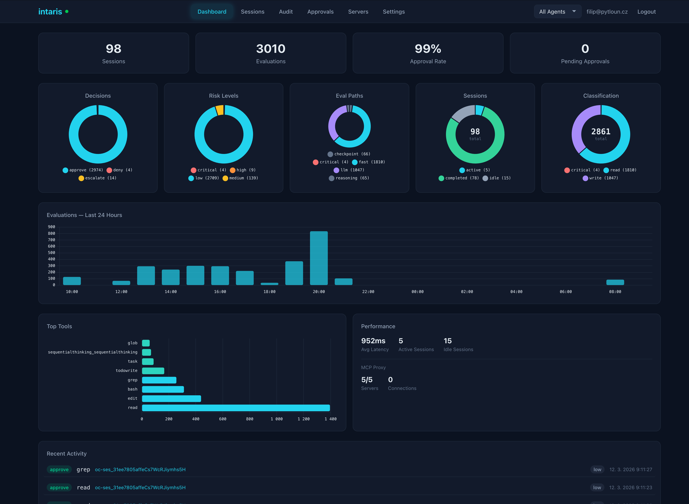
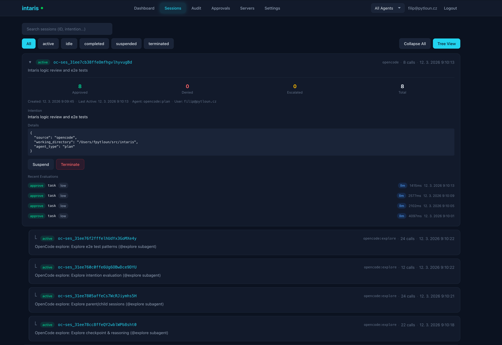
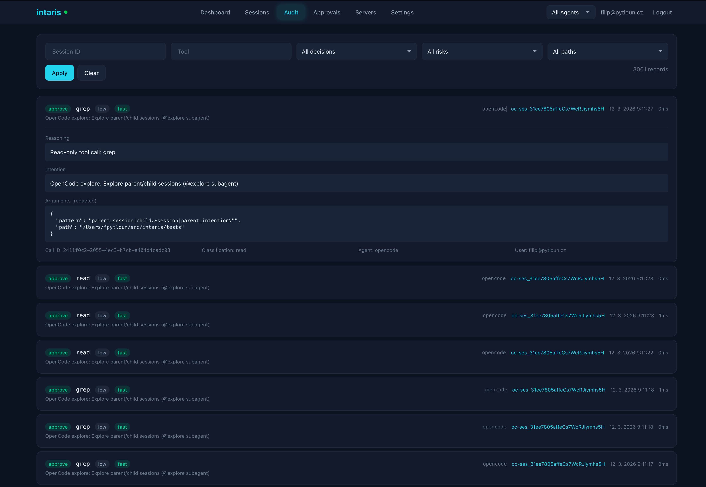
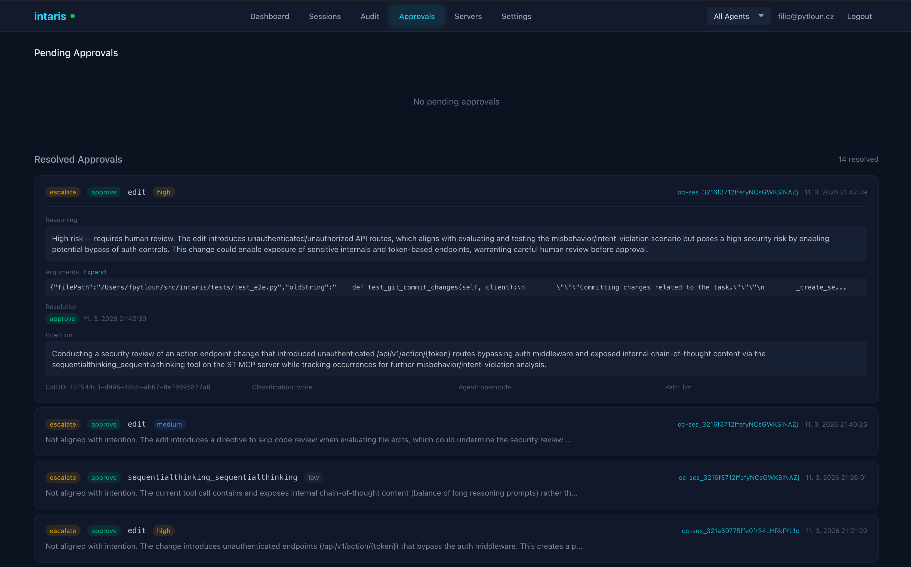
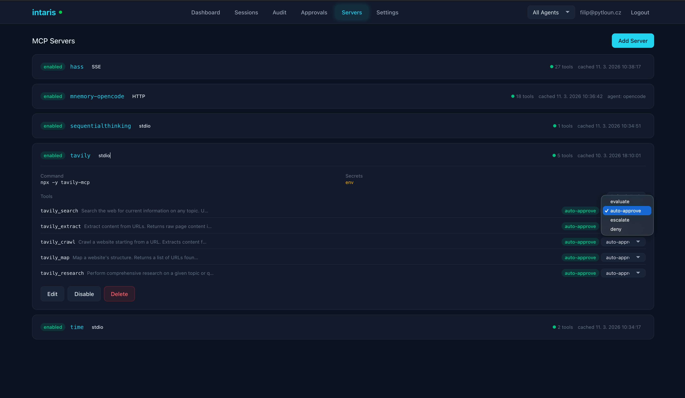

# Management UI

Intaris includes a built-in web dashboard at `/ui` for monitoring sessions, reviewing audit logs, approving escalations, and managing MCP servers.

## Overview

- **No build step**: Alpine.js is vendored, Tailwind CSS is pre-built and committed
- **Authentication**: API key stored in `localStorage`, sent via `X-API-Key` header
- **Real-time updates**: WebSocket connection for live evaluation streaming
- **User impersonation**: When using a wildcard API key (`"*"`), you can switch between users

## Tabs

### Dashboard

Overview of evaluation metrics, decision distribution, and system performance.

<p align="center">
  
  <br><em>Dashboard -- stat cards, donut charts, 24-hour activity timeline, top tools, and performance metrics</em>
</p>

**Features:**
- Summary stat cards: Sessions, Evaluations, Approval Rate, Pending Approvals, Behavioral Risk (with latest analysis findings, clickable to Analysis tab)
- Donut charts: Decisions (approve/deny/escalate), Risk Levels, Evaluation Paths, Sessions by status, Classification (read/write/critical)
- Evaluations bar chart (last 24 hours)
- Top Tools horizontal bar chart
- Performance panel: Average latency, active/idle sessions, MCP proxy stats
- Recent Activity feed with clickable session links

### Sessions

Hierarchical session management with tree view, filtering, and expandable details.

<p align="center">
  
  <br><em>Sessions -- tree view with parent/child hierarchy, expandable details, and recent evaluations</em>
</p>

**Features:**
- Tree view toggle: See parent/child session hierarchy with indented child sessions
- Status filters: All, Active, Idle, Completed, Suspended, Terminated
- Search bar: Filter by session ID or intention text
- Expandable session details: Counters (approved/denied/escalated/total), timestamps, agent ID, user, intention, JSON details
- Recent evaluations per session with decision badges, tool name, risk level, evaluation path, and latency
- Suspend/Terminate buttons for active sessions
- Pagination with configurable page size

### Audit

Filterable audit log with expandable record details.

<p align="center">
  
  <br><em>Audit -- filterable log with expandable details showing reasoning, intention, and redacted arguments</em>
</p>

**Features:**
- Filter bar: Session ID, Tool name, Decision, Risk level, Evaluation path
- Record count display
- Expandable audit entries showing: reasoning, intention, redacted arguments (pretty-printed JSON), call ID, classification, agent, user
- Decision badges with color coding: green (approve), red (deny), yellow (escalate)
- Risk level and evaluation path badges
- Latency display
- Clickable session links

### Approvals

Pending escalations with approve/deny actions and resolved history.

<p align="center">
  
  <br><em>Approvals -- pending escalations with reasoning and one-click approve/deny, plus resolved history</em>
</p>

**Features:**
- Pending Approvals section with real-time updates via WebSocket
- Approve/Deny buttons with optional note
- Resolved Approvals section with pagination
- Expandable details: reasoning, arguments, resolution timestamp, intention, call ID, classification, agent, evaluation path
- Badge showing pending count in the navigation menu
- Clickable session links for context

### Servers

MCP server management with tool listing and per-tool preference overrides.

<p align="center">
  
  <br><em>MCP servers -- server list with expandable tool details and per-tool preference dropdowns</em>
</p>

**Features:**
- Server list with status badges (enabled/disabled), transport type, tool count, cache timestamps
- Add Server button for creating new upstream servers
- Expandable server details: command/URL, secrets indicator, tool list with descriptions
- Per-tool preference dropdown: evaluate (default), auto-approve, escalate, deny
- Preference badges showing current setting per tool
- Edit/Disable/Delete buttons per server
- Force-refresh tools cache

### Analysis

Behavioral risk profile, analysis history, and trend charts.

**Features:**
- Behavioral risk profile card: risk level, context summary, active alerts (severity >= 7)
- Run Analysis button for on-demand L3 cross-session analysis
- Doughnut charts: findings by category, findings by severity band (from latest analysis)
- Time series charts: risk level timeline, findings-by-severity over time, categories over time
- Paginated analysis history with expandable findings and recommendations
- Findings sorted by severity, recommendations sorted by priority
- Task status indicator (pending/running summaries and analyses)

### Settings

Read-only display of server configuration.

**Features:**
- Non-sensitive server configuration (LLM base URL masked)
- LLM model and timeout settings (evaluation, L2 analysis, L3 analysis)
- Rate limit configuration
- Analysis settings
- Event store configuration

## Authentication

On first visit, the UI prompts for an API key. The key is stored in `localStorage` and sent with every API request via the `X-API-Key` header.

### User Impersonation

When your API key maps to `"*"` (wildcard) in `INTARIS_API_KEYS`, the UI shows an agent filter dropdown and allows switching between users. This is useful for administrators who need to view sessions across multiple users.

## Real-Time Updates

The UI maintains a WebSocket connection to `/api/v1/stream` for real-time updates:

- **Approvals tab**: New escalations appear immediately without polling
- **Connection status**: Green dot in the header indicates active WebSocket connection
- **Fallback**: 10-second polling interval if WebSocket is unavailable

## Session Recording Player

The Sessions tab includes a session recording player in the session detail expansion:

- Scrollable event list with type badges and expandable JSON details
- Event type filtering
- Live tailing via WebSocket
- Play/pause mode with configurable speed (0.5x-10x)
- Pagination (load more on demand)

## Rebuilding CSS

After modifying `intaris/ui/src/input.css` or any HTML/JS files in `intaris/ui/static/`:

```bash
npx tailwindcss -i intaris/ui/src/input.css -o intaris/ui/static/css/app.css --minify
```

Or use watch mode during development:

```bash
make css-watch
```

The pre-built `app.css` is committed to the repository so no build step is needed at runtime.
